Material supporting the PhD analyses from Chapters 1, 2, 5.
================
Kamil Kmita

# 0 Set up of the notebook

Libraries.

``` r
set.seed(42)

library(MASS)

library(fussclust)

library(ggplot2)
```

    ## Warning: pakiet 'ggplot2' został zbudowany w wersji R 4.5.2

``` r
library(tidyr)
```

    ## Warning: pakiet 'tidyr' został zbudowany w wersji R 4.5.2

``` r
library(dplyr)
```

    ## Warning: pakiet 'dplyr' został zbudowany w wersji R 4.5.2

    ## 
    ## Dołączanie pakietu: 'dplyr'

    ## Następujący obiekt został zakryty z 'package:MASS':
    ## 
    ##     select

    ## Następujące obiekty zostały zakryte z 'package:stats':
    ## 
    ##     filter, lag

    ## Następujące obiekty zostały zakryte z 'package:base':
    ## 
    ##     intersect, setdiff, setequal, union

``` r
library(fclust)
```

    ## Warning: pakiet 'fclust' został zbudowany w wersji R 4.5.2

``` r
library(tikzDevice)
```

    ## Warning: pakiet 'tikzDevice' został zbudowany w wersji R 4.5.2

``` r
## add a package to the defaults
options(tikzLatexPackages=
            c(getOption("tikzLatexPackages"),"\\usepackage{fixltx2e}"))
```

Prepare `iris` data.

``` r
X <- iris[, c("Sepal.Length", "Sepal.Width")] |> as.matrix()

superF <- matrix(0, nrow = nrow(iris), ncol = 3)
superF[iris$Species == "setosa", 1] <- 1
superF[iris$Species == "versicolor", 2] <- 1
superF[iris$Species == "virginica", 3] <- 1
```

Functions for traceability of random stuff.

``` r
create_U0 <- function() {
  .U0 <- matrix(runif(nrow(X)*3), ncol=3)
  .U0 <- t(apply(.U0, 1, function(x) x / sum(x)))

  return(.U0)
}


create_random_U <- function(.superF) {
  N <- nrow(.superF)
  C <- ncol(.superF)
  U_0 <- matrix(runif(N * C), ncol = C)
  U_0 <- sweep(U_0, 1, rowSums(U_0), "/")
  return(U_0)
}


create_superF <- function(.perc, .test = NULL) {
  ind1 <- sample(1:50, floor(.perc * 50))
  ind2 <- sample(51:100, floor(.perc * 50))
  ind3 <- sample(101:150, floor(.perc * 50))

  superF <- matrix(0, nrow = nrow(iris), ncol = 3)
  superF[ind1, 1] <- 1
  superF[ind2, 2] <- 1
  superF[ind3, 3] <- 1

  out <- list(
    superF = superF, 
    ind = c(ind1, ind2, ind3),
    tind = NULL,
    tclass = NULL
  )
  
  if ( !is.null(.test) ) {
    nleft <- length(setdiff(1:50, ind1))
    tind1 <- sample(setdiff(1:50, ind1), floor(.test * nleft))
    tind2 <- sample(setdiff(51:100, ind2), floor(.test * nleft))
    tind3 <- sample(setdiff(101:150, ind3), floor(.test * nleft))
    
    out$tind <- c(tind1, tind2, tind3)
    out$tclass <- rep(c(1, 2, 3), each = length(tind1))
  }

  return(out)
}
```

``` r
get_accuracy <- function(X, .model, .sf) {
  test_results <- data.frame(
    pred = max.col(predict(.model, X[.sf$tind, ])),
    true = .sf$tclass
  )
  
  accuracy <- sum(test_results$pred == test_results$true) /
      nrow(test_results)
  
  return(accuracy)
}
```

------------------------------------------------------------------------

# 1 Results for Chapter 1 and 2

- Chapter 1.4 Illustratory Example
- Chapter 2.1.3 Possibilistic c-Means

## Chapter 1.4

Get data and metadata stored in the `fussclust/data` folder.

``` r
data("superFstruct_underimpact")
data("U_underimpact")

sfu <- superFstruct_underimpact    # compact name
```

### Plots

``` r
iris2 <- iris
iris2[-sfu$ind, "Species"] <- NA
iris2 <- iris2[-sfu$tind, ]
```

``` r
p1 <- ggplot(iris, aes(Sepal.Length, Sepal.Width, colour = Species)) + 
  geom_point() +
  scale_colour_hue(direction = -1) +
  xlab("sepal length") +
  ylab("sepal width") + 
  scale_x_continuous(limits = c(4, 8)) +
  scale_y_continuous(limits = c(1, 5))
```

``` r
p1
```

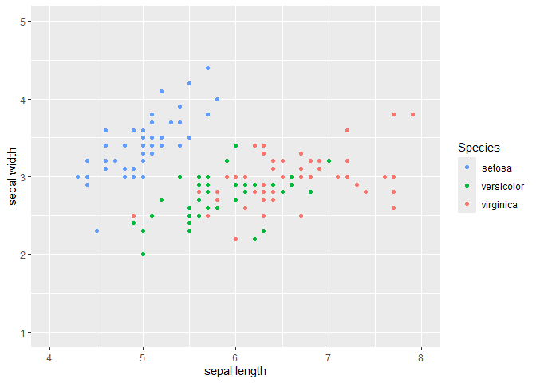<!-- -->

``` r
p2 <- ggplot(iris2, aes(Sepal.Length, Sepal.Width, colour = Species)) + 
  geom_point() +
  scale_colour_hue(direction = -1) +
  xlab("sepal length") +
  ylab("sepal width") + 
  scale_x_continuous(limits = c(4, 8)) +
  scale_y_continuous(limits = c(1, 5))
```

``` r
p2
```

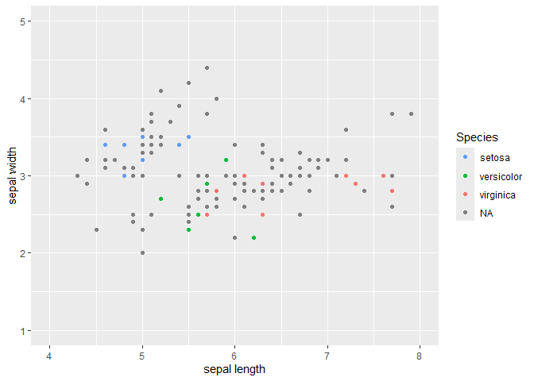<!-- -->

``` r
ggsave(p1,
       filename = "C:/Users/user/Downloads/fig-iris-1-NEW.pdf",
       width = 6.5, 
       height = 4.5, 
       dpi = 300, units = "in", device='pdf')

ggsave(p2,
       filename = "C:/Users/user/Downloads/fig-iris-2-NEW.pdf",
       width = 6.5, 
       height = 4.5, 
       dpi = 300, units = "in", device='pdf')
```

## Numerical results

A following code was executed a few times to obtain results presenting
the consequences of underimpact occurring, that were later stored in the
`data()` functionality of the R package.

``` r
Uz <- create_U0()
superFstruct <- create_superF(.2, .test = .1)
```

`sfu$tind` and `sfu$tclass` hold the indices of the test observations,
and their true classes, respectively.

`sfu$superF` holds the supervision matrix $F$, and `sfu$ind` holds
indices of the observations that remain supervised (the $i=1,\ldots,M$
observations).

``` r
sfu <- superFstruct_underimpact

mss0 <- fussclust::FCM(X = X[-sfu$tind, ], C = 3, U = U_underimpact[-sfu$tind, ])
mpcm <- fussclust::PCM(X = X[-sfu$tind, ], C = 3, 
                      # U = U_underimpact[-sfu$tind, ],
                      U = mss0$U,
                      initFCM = TRUE)

mss1 <- fussclust::SSFCM(X = X[-sfu$tind, ],
                      C = 3,
                      U = U_underimpact[-sfu$tind, ],
                      superF = sfu$superF[-sfu$tind, ],
                      alpha = .1)

mss2 <- fussclust::SSFCM(X = X[-sfu$tind, ],
                      C = 3,
                      U = U_underimpact[-sfu$tind, ],
                      superF = sfu$superF[-sfu$tind, ],
                      alpha = 1)

mss3 <- fussclust::SSFCM(X = X[-sfu$tind, ],
                      C = 3,
                      U = U_underimpact[-sfu$tind, ],
                      superF = sfu$superF[-sfu$tind, ],
                      alpha = 5)
```

Results of several measures on the fitted models.

``` r
ev1 <- lapply(
  list(mss0, mss1, mss2, mss3), function(x) fclust::PC(x$U)
) |> unlist() |> round(3)

ev2 <- lapply(
  list(mss0, mss1, mss2, mss3), function(x) fclust::XB(
    Xca = X[-sfu$tind, ], U = x$U, H = x$V, m = 2
  )
) |> unlist() |> round(3)

ev3 <- lapply(
  list(mss0, mss1, mss2, mss3), function(x) fclust::SIL(X[-sfu$tind, ], x$U)$sil
) |> unlist() |> round(3)

ev4 <- lapply(
  list(mss1, mss2, mss3), function(y) get_accuracy(X, y, sfu)
) |> unlist() |> round(3)

ev4 <- c(NA, ev4)
```

Table with results - text for latex.

``` r
paste0(
  paste0(paste0(c("PC", ev1), collapse = " & "), " \\\\", "\n"),
  paste0(paste0(c("XB", ev2), collapse = " & "), " \\\\", "\n"),
  paste0(paste0(c("Sil", ev3), collapse = " & "), " \\\\", "\n"),
  paste0(paste0(c("acc", ev4), collapse = " & "), " \\\\", "\n")
) |> cat()
```

    ## PC & 0.709 & 0.684 & 0.726 & 0.757 \\
    ## XB & 0.155 & 0.2 & 0.168 & 0.194 \\
    ## Sil & 0.619 & 0.622 & 0.561 & 0.559 \\
    ## acc & NA & 0.083 & 0.833 & 0.833 \\

## Chapter 2.1.3

Reproduction of Figure from Krishanpuram.

``` r
Xoutlier <- rbind(
  MASS::mvrnorm(n = 10, mu = c(3, 5), Sigma = diag(.025, 2)),
  MASS::mvrnorm(n = 10, mu = c(7, 5), Sigma = diag(.025, 2)),
  matrix(c(5, 5, 5, 9), ncol = 2, byrow = TRUE)
) |> as.data.frame()  

colnames(Xoutlier) <- c("x", "y")

Xoutlier$group <- c(
  rep("typical of 1st prototype", 10),
  rep("typical of 2nd prototype", 10),
  c("outlier", "outlier")
)
```

``` r
p_xoutlier <- 
  ggplot(Xoutlier, aes(x, y, group = group, colour = group)) +
  geom_point() +
  scale_x_continuous(limits = c(2, 8)) +
  scale_y_continuous(limits = c(4, 10))
```

``` r
p_xoutlier
```

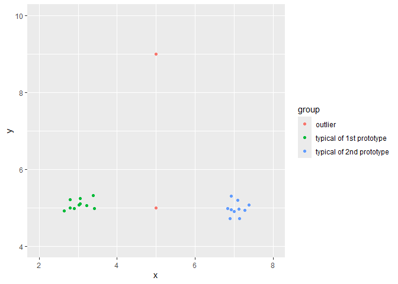<!-- -->

``` r
ggsave(p_xoutlier,
       filename = "fig-fcm-pcm.pdf",
       width = 6.5, 
       height = 4.5, 
       dpi = 300, units = "in", device='pdf')
```

``` r
mfcm_xoutlier <- fussclust::FCM(
  X = as.matrix(Xoutlier[, c(1, 2)]),
  C = 2)

(mfcm_xoutlier$U[c(21, 22), ] |> round(2))
```

    ##      [,1] [,2]
    ## [1,] 0.48 0.52
    ## [2,] 0.48 0.52

``` r
mpcm_xoutlier <- fussclust::PCM(
  X = as.matrix(Xoutlier[, c(1, 2)]),
  C = 2)

(mpcm_xoutlier$U[c(21, 22), ] |> round(2))
```

    ##      [,1] [,2]
    ## [1,] 0.21 0.20
    ## [2,] 0.05 0.05

Coincident clusters’ prototypes - iris data example.

``` r
mss0$V |> round(3)
```

    ##      Sepal.Length Sepal.Width
    ## [1,]        6.856       3.077
    ## [2,]        5.822       2.750
    ## [3,]        4.978       3.340

``` r
mpcm$V |> round(3)
```

    ##      Sepal.Length Sepal.Width
    ## [1,]        5.933       2.909
    ## [2,]        5.939       2.904
    ## [3,]        5.939       2.905

------------------------------------------------------------------------

# 2 Results for Chapter 5

------------------------------------------------------------------------

## Chapter 5.1.1

### Numerical results

Decision prototypes for SSFCmeans.

``` r
matrix_to_latex <- function(.model) {
  mat <- .model$V |> round(3)
  
  latex_table <- apply(mat, 1, function(row) {
    paste(row, collapse = " & ")
  })
  
  latex_table <- paste(latex_table, collapse = " \\\\ \n")
  
  return(cat(latex_table))
}
```

``` r
matrix_to_latex(mss1)
```

    ## 5.75 & 2.757 \\ 
    ## 6.776 & 3.057 \\ 
    ## 5.04 & 3.341

``` r
matrix_to_latex(mss2)
```

    ## 4.982 & 3.351 \\ 
    ## 5.8 & 2.746 \\ 
    ## 6.779 & 3.041

``` r
matrix_to_latex(mss3)
```

    ## 4.984 & 3.355 \\ 
    ## 5.797 & 2.747 \\ 
    ## 6.749 & 3.023

Averages.

``` r
iris[-sfu$tind, c("Sepal.Length", "Species")] %>%
  group_by(Species) %>%
  summarise(avg = mean(Sepal.Length)) %>%
  mutate(avg = round(avg, 3))
```

    ## # A tibble: 3 × 2
    ##   Species      avg
    ##   <fct>      <dbl>
    ## 1 setosa      5.00
    ## 2 versicolor  5.91
    ## 3 virginica   6.62

### Plots

``` r
iris3 <- iris
iris3 <- iris3[sfu$tind, ]
```

``` r
p3 <- ggplot() + 
  geom_point(data = iris3, aes(Sepal.Length, Sepal.Width, colour = Species)) +
  geom_point(data = as.data.frame(mss1$V), aes(Sepal.Length, Sepal.Width), 
             shape = 7) + 
  scale_colour_hue(direction = -1) +
  xlab("sepal length") +
  ylab("sepal width") + 
  scale_x_continuous(limits = c(4, 8)) +
  scale_y_continuous(limits = c(1, 5))
```

``` r
p4 <- p3 +
  annotate("text", x = 5.75 + 0.025, y = 2.75 - 0.2, label = expression(tilde(v)[1])) +
  annotate("text", x = 6.77 + 0.025, y = 3.05 - 0.2, label = expression(tilde(v)[2])) +
  annotate("text", x = 5.04 + 0.025, y = 3.34 - 0.2, label = expression(tilde(v)[3]))
```

``` r
p4
```

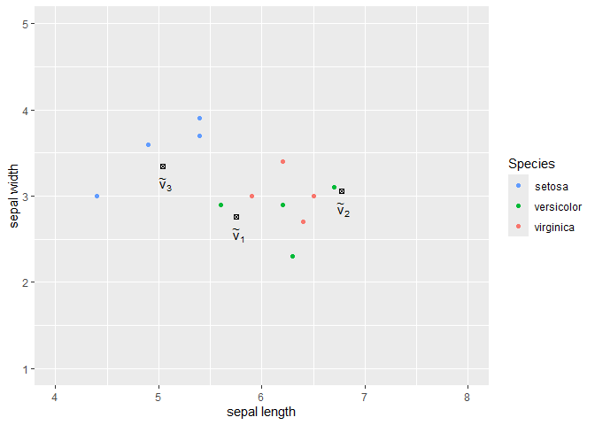<!-- -->

``` r
ggsave(p4,
       filename = "C:/Users/user/Downloads/fig-iris-test.pdf",
       width = 6.5, 
       height = 4.5, 
       dpi = 300, units = "in", device='pdf')
```

------------------------------------------------------------------------

## Chapter 5.1.2

**coincident’ clusters’ prototypes.**

Decision prototypes for SSPCMeans.

``` r
mssp1 <- fussclust::SSPCM(X = X[-sfu$tind, ],
                      C = 3,
                      U = U_underimpact[-sfu$tind, ],
                      superF = sfu$superF[-sfu$tind, ],
                      alpha = .1,
                      initFCM = TRUE)

mssp2 <- fussclust::SSPCM(X = X[-sfu$tind, ],
                      C = 3,
                      U = U_underimpact[-sfu$tind, ],
                      superF = sfu$superF[-sfu$tind, ],
                      alpha = 1,
                      initFCM = TRUE)

mssp3 <- fussclust::SSPCM(X = X[-sfu$tind, ],
                      C = 3,
                      U = U_underimpact[-sfu$tind, ],
                      superF = sfu$superF[-sfu$tind, ],
                      alpha = 5,
                      initFCM = TRUE)
```

``` r
matrix_to_latex(mssp1)
```

    ## 5.895 & 2.915 \\ 
    ## 5.936 & 2.901 \\ 
    ## 5.967 & 2.905

``` r
matrix_to_latex(mssp2)
```

    ## 5.367 & 3.134 \\ 
    ## 5.908 & 2.872 \\ 
    ## 6.229 & 2.92

``` r
matrix_to_latex(mssp3)
```

    ## 5.061 & 3.304 \\ 
    ## 5.86 & 2.811 \\ 
    ## 6.559 & 2.903

------------------------------------------------------------------------

## Chapter 5.1.3

Condition 1 untoward initialization of $U^{(0)}$.

``` r
few_examples <- as.data.frame(U_underimpact[sfu$ind, ] |> round(3))
few_examples$si <- max.col(sfu$superF[sfu$ind, ])
colnames(few_examples) <- c("U1", "U2", "U3", "si")

few_examples <- few_examples[c(1, 2, 11, 13, 21, 27), ]
few_examples$i <- c(1, 2, 11, 13, 21, 27)

few_examples <- few_examples[, c("i", "si", "U1", "U2", "U3")]
```

``` r
few_examples_text <- apply(few_examples, 1, function(row) 
  paste(row, collapse = " & "))
few_examples_text <- paste(few_examples_text, collapse = " \\\\ \n")
cat(few_examples_text)
```

    ## 1 & 1 & 0.361 & 0.352 & 0.287 \\ 
    ## 2 & 1 & 0.055 & 0.439 & 0.506 \\ 
    ## 11 & 2 & 0.42 & 0.008 & 0.573 \\ 
    ## 13 & 2 & 0.092 & 0.456 & 0.452 \\ 
    ## 21 & 3 & 0.526 & 0.057 & 0.418 \\ 
    ## 27 & 3 & 0.044 & 0.325 & 0.631

``` r
lapply(list(mss1, mss2, mss3), function(x) x$counter) |> unlist()
```

    ## [1] 21 17 14

A function to select 2 out of 3 columns from $\mathcal{E}_i$ set.

``` r
non_supervised_columns.internal2 <- function(.A, .ncolumns) {
  B <- matrix(0, nrow = nrow(.A), ncol = .ncolumns)
  for (row in 1:nrow(.A)) {
    index <- 0
    for (.col in 1:ncol(.A)) {
      value <- .A[row, .col]
      if (value > 0) {
        index <- index + 1
        B[row, index] <- value
      }
    }
  }

  return(B)
}


non_supervised_columns_model2 <- function(.Phi, .superF, .reindexed, .ncolumns) {
  out <- non_supervised_columns.internal2(
    .A = .Phi[.reindexed, ] * (1 - .superF[.reindexed, ]),
    .ncolumns
  )
  
  return(out)
}


supervised_column_model <- function(.Phi, .superF, .reindexed) {
  rowSums(.Phi * .superF)[sort(.reindexed)]
}


create_df_model2 <- function(.Phi, .superF, .alpha, .ncolumns, enhance = FALSE) {
  reindexed <- which(rowSums(.superF) > 0)
  superF <- .superF
  
  out <- as.data.frame(cbind(
    supervised_column_model(.Phi, superF, reindexed), 
    non_supervised_columns_model2(.Phi, superF, reindexed, .ncolumns)
  ))
  
  colnames(out) <- c("si", paste0("ei", 1:.ncolumns))
  
  out2 <- tidyr::pivot_longer(
    out, cols = colnames(out), names_to = "group", values_to = "value"
  )
  
  out2$group <- gsub("^ei\\d+$", "ei", out2$group)
  out2$alpha <- .alpha
  out2$group <- factor(out2$group, levels = c("si", "ei"))
  
  if (enhance) {
    to_add <- data.frame(
      value = .Phi[-reindexed, ] |> as.vector(),
      alpha = .alpha,
      group = "uhk"
    )
    
    out2$group <- factor(out2$group, levels = c("si", "ei", "uhk"))
    
    out2 <- rbind(out2, to_add)
  }
  
  return(out2)
}
```

``` r
create_boxplot <- function(.df, .limits = NULL, .l = 1, .outlier.shape = 19) {
  out <-
    ggplot(.df, aes(x = group, y = value, fill = group)) +
    geom_boxplot(outlier.shape = .outlier.shape) +
    xlab("") +
    ylab("") +
    scale_x_discrete(
      labels = c(
        paste0("$\\{\\phi^{(", .l, ")}_{i, k = s(i)}\\}$"),
        #"$\\{\\phi_{i, k \\in \\mathcal{E}_{i}}\\}$",
        paste0("$\\{ \\phi^{(", .l, ")}_{i,\\mathcal{E}_i} \\}$"),
        #"$\\{\\phi_{hk}\\}$"
        paste0("$\\{ \\phi^{(", .l, ")}_{hk} \\}$")
    )) +
    theme(
      axis.text.x = element_text(size = 16, margin = margin(t = 10)),
      axis.text.y = element_text(size = 14),
      legend.position = "none"
    )
  
  if (!is.null(.limits)) {
    out <- out +
      scale_y_continuous(limits = .limits)
  }
  
  return(out)
}
```

``` r
create_df_model2(
  .Phi = mss0$Phi_history[[1]],
  .superF = sfu$superF[-sfu$tind, ],
  .alpha = 0,
  .ncolumns = 2,
  enhance = TRUE
) %>%
  create_boxplot(.limits = c(0, 1))
```

<!-- -->

``` r
box_0 <- create_df_model2(
  .Phi = mss0$Phi_history[[1]], 
  .superF = sfu$superF[-sfu$tind, ],
  .alpha = 0,
  .ncolumns = 2,
  enhance = TRUE
) %>%
  create_boxplot(.limits = c(0, 1))


box_1 <- create_df_model2(
  .Phi = mss1$Phi_history[[1]], 
  .superF = sfu$superF[-sfu$tind, ],
  .alpha = .1,
  .ncolumns = 2,
  enhance = TRUE  
) %>%
  create_boxplot(.limits = c(0, 1))


box_2 <- create_df_model2(
  .Phi = mss2$Phi_history[[1]], 
  .superF = sfu$superF[-sfu$tind, ],
  .alpha = 1,
  .ncolumns = 2,
  enhance = TRUE    
) %>%
  create_boxplot()


box_3 <- create_df_model2(
  .Phi = mss3$Phi_history[[1]], 
  .superF = sfu$superF[-sfu$tind, ],
  .alpha = 5,
  .ncolumns = 2,
  enhance = TRUE    
) %>%
  create_boxplot()
```

``` r
box_0
```

<!-- -->

``` r
box_1
```

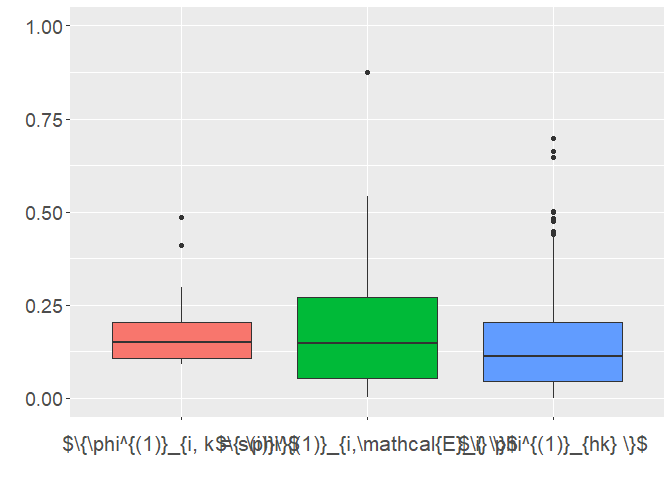<!-- -->

``` r
box_2
```

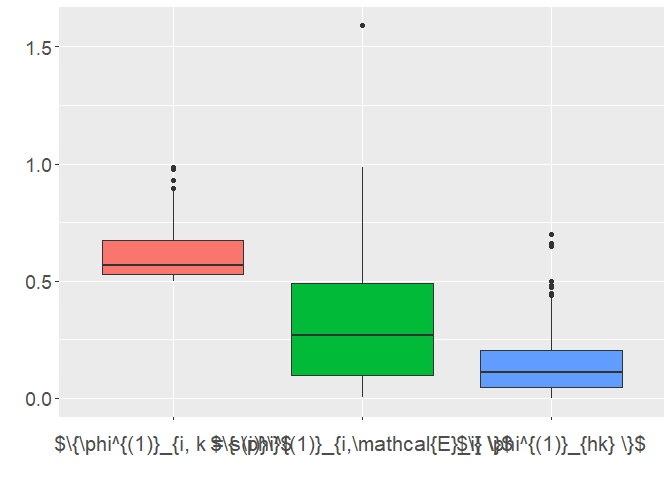<!-- -->

``` r
box_3
```

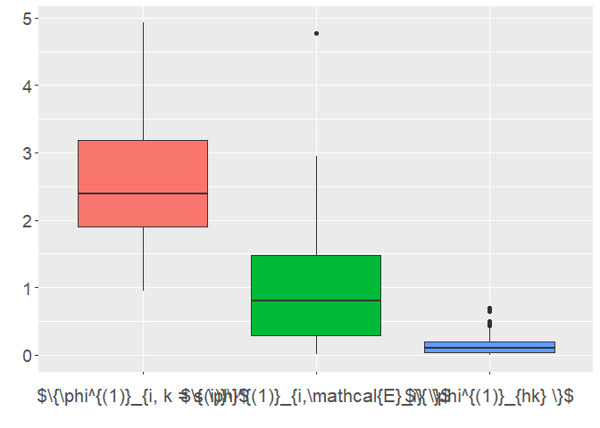<!-- -->

``` r
# 1st plot
tikz("under-super-0.tex",
     standAlone = TRUE, width = 6.5, height = 4.5)

box_0

dev.off()
```

    ## png 
    ##   2

``` r
system("pdflatex under-super-0.tex")
```

    ## [1] 0

``` r
# 2nd plot
tikz("under-super-1.tex",
     standAlone = TRUE, width = 6.5, height = 4.5)

box_1

dev.off()
```

    ## png 
    ##   2

``` r
system("pdflatex under-super-1.tex")
```

    ## [1] 0

``` r
# 3rd plot
tikz("under-super-2.tex",
     standAlone = TRUE, width = 6.5, height = 4.5)

box_2
dev.off()
```

    ## png 
    ##   2

``` r
system("pdflatex under-super-2.tex")
```

    ## [1] 0

``` r
# 4th plot
tikz("under-super-3.tex",
     standAlone = TRUE, width = 6.5, height = 4.5)

box_3
dev.off()
```

    ## png 
    ##   2

``` r
system("pdflatex under-super-3.tex")
```

    ## [1] 0

``` r
box_0alt <- create_df_model2(
  .Phi = mss0$Phi_history[[mss0$counter]], 
  .superF = sfu$superF[-sfu$tind, ],
  .alpha = 0,
  .ncolumns = 2,
  enhance = TRUE
) %>%
  create_boxplot(.limits = c(0, 1), .l = "L")


box_1alt <- create_df_model2(
  .Phi = mss1$Phi_history[[mss1$counter]], 
  .superF = sfu$superF[-sfu$tind, ],
  .alpha = .1,
  .ncolumns = 2,
  enhance = TRUE  
) %>%
  create_boxplot(.limits = c(0, 1), .l = "L")


box_2alt <- create_df_model2(
  .Phi = mss2$Phi_history[[mss2$counter]], 
  .superF = sfu$superF[-sfu$tind, ],
  .alpha = 1,
  .ncolumns = 2,
  enhance = TRUE   
) %>%
  create_boxplot(.limits = c(0, 1), .l = "L")


box_3alt <- create_df_model2(
  .Phi = mss3$Phi_history[[mss3$counter]], 
  .superF = sfu$superF[-sfu$tind, ],
  .alpha = 5,
  .ncolumns = 2,
  enhance = TRUE  
) %>%
  create_boxplot(.limits = c(0, 1), .l = "L")
```

``` r
box_0alt
```

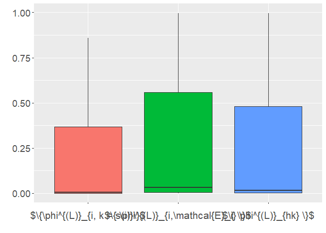<!-- -->

``` r
box_1alt
```

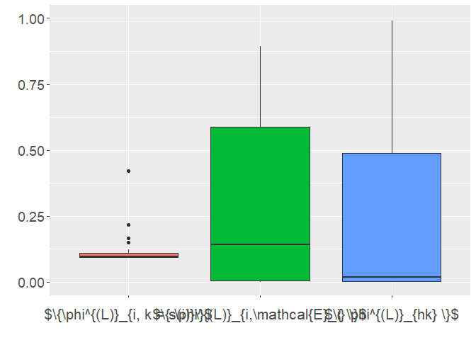<!-- -->

``` r
box_2alt
```

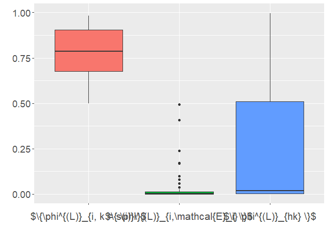<!-- -->

``` r
box_3alt
```

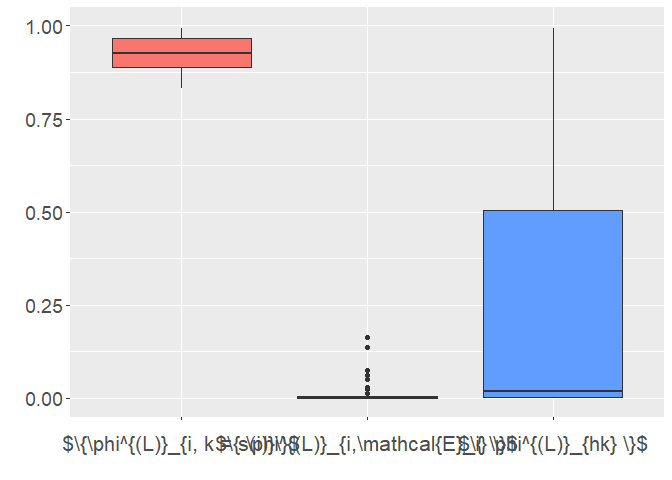<!-- -->

``` r
# 1st plot
tikz("under-super-0a.tex",
     standAlone = TRUE, width = 6.5, height = 4.5)

box_0alt

dev.off()
```

    ## png 
    ##   2

``` r
system("pdflatex under-super-0a.tex")
```

    ## [1] 0

``` r
# 2nd plot
tikz("under-super-1a.tex",
     standAlone = TRUE, width = 6.5, height = 4.5)

box_1alt

dev.off()
```

    ## png 
    ##   2

``` r
system("pdflatex under-super-1a.tex")
```

    ## [1] 0

``` r
# 3rd plot
tikz("under-super-2a.tex",
     standAlone = TRUE, width = 6.5, height = 4.5)

box_2alt
dev.off()
```

    ## png 
    ##   2

``` r
system("pdflatex under-super-2a.tex")
```

    ## [1] 0

``` r
# 4th plot
tikz("under-super-3a.tex",
     standAlone = TRUE, width = 6.5, height = 4.5)

box_3alt
dev.off()
```

    ## png 
    ##   2

``` r
system("pdflatex under-super-3a.tex")
```

    ## [1] 0

------------------------------------------------------------------------

# Chapter 5.1.5

### U-plot for iris

``` r
models_iris <- list()
alphas <- seq(from = 0.01, to = 1, by = 0.01)

for (k in seq_along(alphas)) {
  models_iris[[k]] <- fussclust::SSFCM(
    X = X[-sfu$tind, ], 
    C = 3, 
    U = U_underimpact[-sfu$tind, ],
    superF = sfu$superF[-sfu$tind, ],
    alpha = alphas[k]
  )
}
```

``` r
create_uplot <- function(.models, .alphas, .filter = NA) {
  outcomes <- vector()
  
  for (i in 2:length(.models)) {
    outcomes <- c(outcomes,
                  base::norm(.models[[i]]$V - .models[[i-1]]$V, type = "f"))
  }
  
  df_for_uplot <- data.frame(
    alpha = .alphas[-1],
    value = outcomes
  )
  
  if (!is.na(.filter)) {
    df_for_uplot <- df_for_uplot %>% filter(alpha <= .filter)
  }
  
  uplot <- ggplot(df_for_uplot, aes(alpha, value)) +
    geom_point() +
    geom_line() +
    ylab("$\\delta_r$") +
    xlab("$\\alpha_r$") +
      theme(
        axis.text.x = element_text(size = 14),
        axis.text.y = element_text(size = 14),
        axis.title.x = element_text(size = 16), #, margin = margin(t = 10)),
        axis.title.y = element_text(size = 16),
        legend.position = "none"
      )
  
  return(list(df = df_for_uplot, uplot = uplot))
}
```

``` r
rc <- create_uplot(models_iris, alphas)
uplot_iris_whole <- rc$uplot
dd_iris_whole <- rc$df

rc <- create_uplot(models_iris, alphas, .filter = .25)
uplot_iris_filter <- rc$uplot
dd_iris <- rc$df
```

``` r
uplot_iris_whole + 
  geom_vline(xintercept = 0.25, colour = "red", linetype = "dashed")
```

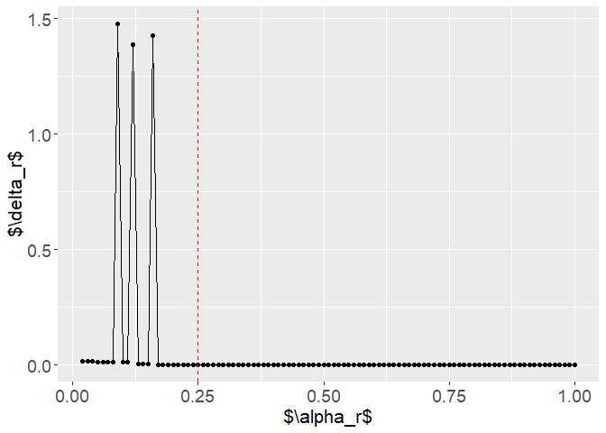<!-- -->

``` r
uplot_iris_filter
```

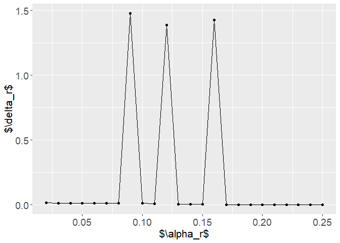<!-- -->

``` r
tikz("uplot-iris-whole.tex",
     standAlone = TRUE, width = 6.5, height = 4.5)

uplot_iris_whole + 
  geom_vline(xintercept = 0.25, colour = "red", linetype = "dashed")
dev.off()
```

    ## png 
    ##   2

``` r
system("pdflatex uplot-iris-whole.tex")
```

    ## [1] 0

``` r
tikz("uplot-iris-filter.tex",
     standAlone = TRUE, width = 6.5, height = 4.5)

uplot_iris_filter
dev.off()
```

    ## png 
    ##   2

``` r
system("pdflatex uplot-iris-filter.tex")
```

    ## [1] 0

*Example for Chapter simulations.*

``` r
sd(dd_iris_whole$value)
```

    ## [1] 0.246509

``` r
sd(dd_iris$value)
```

    ## [1] 0.4816545

``` r
uplot_iris_whole + 
  geom_vline(xintercept = 0.25, colour = "red", linetype = "dashed") +
  geom_hline(yintercept = sd(dd_iris_whole$value), colour = "blue", 
             linetype = "dashed")
```

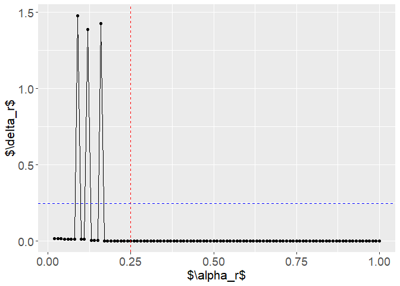<!-- -->

``` r
uplot_iris_filter +
  geom_hline(yintercept = sd(dd_iris$value), colour = "blue", 
             linetype = "dashed")  
```

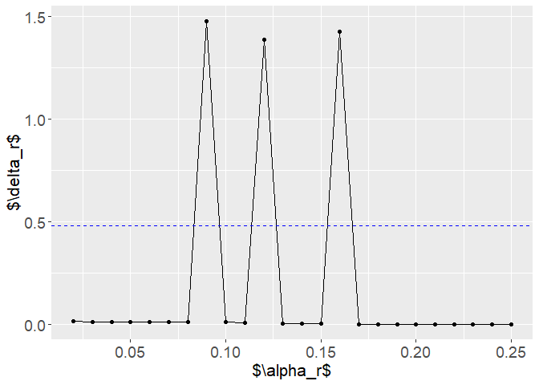<!-- -->

``` r
tikz("uplot-iris-whole-sd.tex",
     standAlone = TRUE, width = 6.5, height = 4.5)

uplot_iris_whole + 
  geom_vline(xintercept = 0.25, colour = "red", linetype = "dashed") +
  geom_hline(yintercept = sd(dd_iris_whole$value), colour = "blue", 
             linetype = "dashed")
dev.off()
```

    ## png 
    ##   2

``` r
system("pdflatex uplot-iris-whole-sd.tex")
```

    ## [1] 0

``` r
tikz("uplot-iris-filter-sd.tex",
     standAlone = TRUE, width = 6.5, height = 4.5)

uplot_iris_filter +
  geom_hline(yintercept = sd(dd_iris$value), colour = "blue", 
             linetype = "dashed")  
dev.off()
```

    ## png 
    ##   2

``` r
system("pdflatex uplot-iris-filter-sd.tex")
```

    ## [1] 0

*Continuation of underimpact analyses*

``` r
dd2_iris <- dd_iris %>% mutate(value = round(value, 3))

ordered_values <- lapply(
  models_iris, 
  function(x) order(as.vector(x$V[, 1])) |> 
    paste0(collapse = ", ")
  ) |> 
    unlist()

dd2_iris$order <- ordered_values[-1][1:24]
dd2_iris$flag <- identical(dd2_iris$order, "1, 2, 3")
```

``` r
dd2_iris
```

    ##    alpha value   order  flag
    ## 1   0.02 0.016 3, 2, 1 FALSE
    ## 2   0.03 0.015 3, 2, 1 FALSE
    ## 3   0.04 0.014 3, 2, 1 FALSE
    ## 4   0.05 0.014 3, 2, 1 FALSE
    ## 5   0.06 0.013 3, 2, 1 FALSE
    ## 6   0.07 0.013 3, 2, 1 FALSE
    ## 7   0.08 0.012 3, 2, 1 FALSE
    ## 8   0.09 1.478 3, 1, 2 FALSE
    ## 9   0.10 0.011 3, 1, 2 FALSE
    ## 10  0.11 0.011 3, 1, 2 FALSE
    ## 11  0.12 1.389 1, 3, 2 FALSE
    ## 12  0.13 0.006 1, 3, 2 FALSE
    ## 13  0.14 0.006 1, 3, 2 FALSE
    ## 14  0.15 0.006 1, 3, 2 FALSE
    ## 15  0.16 1.429 1, 2, 3 FALSE
    ## 16  0.17 0.001 1, 2, 3 FALSE
    ## 17  0.18 0.001 1, 2, 3 FALSE
    ## 18  0.19 0.001 1, 2, 3 FALSE
    ## 19  0.20 0.001 1, 2, 3 FALSE
    ## 20  0.21 0.001 1, 2, 3 FALSE
    ## 21  0.22 0.001 1, 2, 3 FALSE
    ## 22  0.23 0.001 1, 2, 3 FALSE
    ## 23  0.24 0.001 1, 2, 3 FALSE
    ## 24  0.25 0.001 1, 2, 3 FALSE

``` r
matrix_to_latex <- function(.matrix) {
  mat <- .matrix
  
  latex_table <- apply(mat, 1, function(row) {
    paste(row, collapse = " & ")
  })
  
  latex_table <- paste(latex_table, collapse = " \\\\ \n")
  
  return(cat(latex_table))
}
```

``` r
matrix_to_latex(dd2_iris %>% 
                  filter(alpha <= 0.25) %>% 
                  dplyr::select(alpha, value, order))
```

    ## 0.02 & 0.016 & 3, 2, 1 \\ 
    ## 0.03 & 0.015 & 3, 2, 1 \\ 
    ## 0.04 & 0.014 & 3, 2, 1 \\ 
    ## 0.05 & 0.014 & 3, 2, 1 \\ 
    ## 0.06 & 0.013 & 3, 2, 1 \\ 
    ## 0.07 & 0.013 & 3, 2, 1 \\ 
    ## 0.08 & 0.012 & 3, 2, 1 \\ 
    ## 0.09 & 1.478 & 3, 1, 2 \\ 
    ## 0.10 & 0.011 & 3, 1, 2 \\ 
    ## 0.11 & 0.011 & 3, 1, 2 \\ 
    ## 0.12 & 1.389 & 1, 3, 2 \\ 
    ## 0.13 & 0.006 & 1, 3, 2 \\ 
    ## 0.14 & 0.006 & 1, 3, 2 \\ 
    ## 0.15 & 0.006 & 1, 3, 2 \\ 
    ## 0.16 & 1.429 & 1, 2, 3 \\ 
    ## 0.17 & 0.001 & 1, 2, 3 \\ 
    ## 0.18 & 0.001 & 1, 2, 3 \\ 
    ## 0.19 & 0.001 & 1, 2, 3 \\ 
    ## 0.20 & 0.001 & 1, 2, 3 \\ 
    ## 0.21 & 0.001 & 1, 2, 3 \\ 
    ## 0.22 & 0.001 & 1, 2, 3 \\ 
    ## 0.23 & 0.001 & 1, 2, 3 \\ 
    ## 0.24 & 0.001 & 1, 2, 3 \\ 
    ## 0.25 & 0.001 & 1, 2, 3

------------------------------------------------------------------------

### U-plot for bipolar data

``` r
normalize_data <- function(X) {
  min_max_norm <- function(x) {
    (x - min(x)) / (max(x) - min(x))
  }
  
  Xout <- X
  for (r in 1:ncol(X)) {
    Xout[, r] <- min_max_norm(Xout[, r])
  }
  
  return(Xout)
}
```

Artificial data creation.

``` r
set.seed(42)
Ubd <- create_random_U(superF)
```

Real data reading.

``` r
feature_names <- c(
  "avg_jitterlocal_sma",                
  "avg_jitterddp_sma",                  
  "avg_shimmerlocal_sma",               
  "avg_pcm_fftmag_spectralflux_sma",    
  "avg_pcm_fftmag_spectralcentroid_sma"
)
```

``` r
source_df1 <- read.csv("C:/Users/user/Desktop/doktorat/temp/baseline_long.csv",
                       sep = ";")
```

``` r
X <- source_df1[, feature_names]
```

``` r
labels_names <- c(
  "depression", "mixed", "euthymia", "dysfunction")

superFf <- source_df1[, labels_names]
```

``` r
Xall <- normalize_data(X) |> as.matrix()
superF2 <- as.matrix(superFf)
```

# Fitting the models for the sequence $(0, 3)$

``` r
models_bd <- list()
alphas <- seq(0.01, 3, 0.01)


set.seed(42)

Uinit <- create_random_U(superF2)

for (k in seq_along(alphas)) {
  models_bd[[k]] <- fussclust::SSFCM(
    X = Xall, 
    C = 4, 
    U = Uinit,
    superF = superF2,
    alpha = alphas[k]
  )
}
```

``` r
rc <- create_uplot(models_bd, alphas)
dd_bd <- rc$df
uplot_bipolar <- rc$uplot
```

``` r
v4 <- models_bd[[4]]$V |> round(2)
v9 <- models_bd[[9]]$V |> round(2)
v31 <- models_bd[[31]]$V |> round(2)
colnames(v4) <- paste0("V", 1:5)
colnames(v9) <- paste0("V", 1:5)
colnames(v31) <- paste0("V", 1:5)
```

``` r
uplot_bipolar +
  geom_vline(xintercept = 0.4, colour = "red", linetype = "dashed")
```

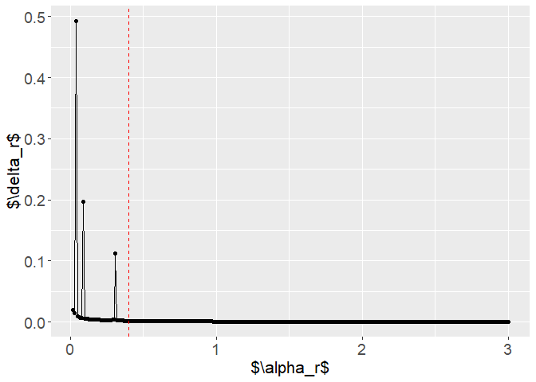<!-- -->

``` r
tikz("uplot-bipolar.tex",
     standAlone = TRUE, width = 6.5, height = 4.5)

uplot_bipolar +
  geom_vline(xintercept = 0.4, colour = "red", linetype = "dashed")
dev.off()
```

    ## png 
    ##   2

``` r
system("pdflatex uplot-bipolar.tex")
```

    ## [1] 0

``` r
uplot_bipolar +
  scale_x_continuous(limits = c(0, 0.4))
```

    ## Warning: Removed 260 rows containing missing values or values outside the scale range
    ## (`geom_point()`).

    ## Warning: Removed 260 rows containing missing values or values outside the scale range
    ## (`geom_line()`).

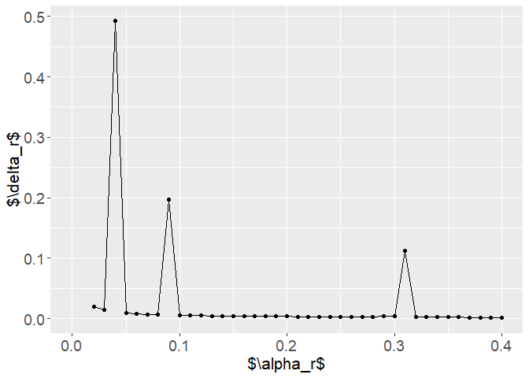<!-- -->

``` r
tikz("uplot-bipolar-filter.tex",
     standAlone = TRUE, width = 6.5, height = 4.5)

uplot_bipolar +
  scale_x_continuous(limits = c(0, 0.4))
```

    ## Warning: Removed 260 rows containing missing values or values outside the scale range
    ## (`geom_point()`).

    ## Warning: Removed 260 rows containing missing values or values outside the scale range
    ## (`geom_line()`).

``` r
dev.off()
```

    ## png 
    ##   2

``` r
system("pdflatex uplot-bipolar-filter.tex")
```

    ## [1] 0

``` r
c(alphas[4], alphas[9], alphas[31])    # candidates for thresholds
```

    ## [1] 0.04 0.09 0.31

First candidate.

``` r
matrix_to_latex(models_bd[[3]]$V |> round(3))
```

    ## 0.273 & 0.194 & 0.369 & 0.033 & 0.523 \\ 
    ## 0.165 & 0.108 & 0.31 & 0.021 & 0.51 \\ 
    ## 0.112 & 0.069 & 0.222 & 0.013 & 0.454 \\ 
    ## 0.514 & 0.383 & 0.481 & 0.09 & 0.426

``` r
matrix_to_latex(models_bd[[4]]$V |> round(3))
```

    ## 0.513 & 0.383 & 0.481 & 0.091 & 0.425 \\ 
    ## 0.165 & 0.108 & 0.31 & 0.021 & 0.51 \\ 
    ## 0.114 & 0.07 & 0.226 & 0.013 & 0.455 \\ 
    ## 0.268 & 0.19 & 0.366 & 0.032 & 0.524

Two decimal places.

``` r
matrix_to_latex(models_bd[[3]]$V |> round(2))
```

    ## 0.27 & 0.19 & 0.37 & 0.03 & 0.52 \\ 
    ## 0.17 & 0.11 & 0.31 & 0.02 & 0.51 \\ 
    ## 0.11 & 0.07 & 0.22 & 0.01 & 0.45 \\ 
    ## 0.51 & 0.38 & 0.48 & 0.09 & 0.43

``` r
matrix_to_latex(models_bd[[4]]$V |> round(2))
```

    ## 0.51 & 0.38 & 0.48 & 0.09 & 0.43 \\ 
    ## 0.17 & 0.11 & 0.31 & 0.02 & 0.51 \\ 
    ## 0.11 & 0.07 & 0.23 & 0.01 & 0.46 \\ 
    ## 0.27 & 0.19 & 0.37 & 0.03 & 0.52

``` r
dd2_bd <- dd_bd %>% mutate(value = round(value, 3))

ordered_values <- lapply(
  models_bd, 
  function(x) order(as.vector(x$V[, 1])) |> 
    paste0(collapse = ", ")
  ) |> 
    unlist()

dd2_bd$order <- ordered_values[-1]
dd2_bd$candidate <- ""
dd2_bd[c(4, 9, 31) - 1, "candidate"] <- "cand"
```

``` r
matrix_to_latex_new <- function(.matrix) {
  
  #mat <- .matrix
  mat <- dd2_bd %>% filter(alpha <= 0.4)
  
  mat <-
  rbind(data.frame(alpha = 0.01, value = NA, order = mat[1, "order"], candidate = ""),
        mat)
  
  latex_table <- apply(mat, 1, function(row) {
    paste(row, collapse = " & ")
  })
  
  out <- vector()
  
  for (i in 1:20) {
    out[i] <- paste0(latex_table[i], " & ", latex_table[i+20])
  }
  
  out2 <- paste(out, collapse = " \\\\ \n")
  
  return(latex_table)
}
```

``` r
aa <- matrix_to_latex_new(dd2_bd %>% filter(alpha <= 0.4))
```

``` r
aa
```

    ##  [1] "0.01 & NA & 3, 2, 1, 4 & "        "0.02 & 0.020 & 3, 2, 1, 4 & "    
    ##  [3] "0.03 & 0.014 & 3, 2, 1, 4 & "     "0.04 & 0.493 & 3, 2, 4, 1 & cand"
    ##  [5] "0.05 & 0.009 & 3, 2, 4, 1 & "     "0.06 & 0.008 & 3, 2, 4, 1 & "    
    ##  [7] "0.07 & 0.007 & 3, 2, 4, 1 & "     "0.08 & 0.007 & 3, 2, 4, 1 & "    
    ##  [9] "0.09 & 0.197 & 3, 4, 2, 1 & cand" "0.10 & 0.005 & 3, 4, 2, 1 & "    
    ## [11] "0.11 & 0.005 & 3, 4, 2, 1 & "     "0.12 & 0.005 & 3, 4, 2, 1 & "    
    ## [13] "0.13 & 0.005 & 3, 4, 2, 1 & "     "0.14 & 0.004 & 3, 4, 2, 1 & "    
    ## [15] "0.15 & 0.004 & 3, 4, 2, 1 & "     "0.16 & 0.004 & 3, 4, 2, 1 & "    
    ## [17] "0.17 & 0.004 & 3, 4, 2, 1 & "     "0.18 & 0.004 & 3, 4, 2, 1 & "    
    ## [19] "0.19 & 0.004 & 3, 4, 2, 1 & "     "0.20 & 0.004 & 3, 4, 2, 1 & "    
    ## [21] "0.21 & 0.003 & 3, 4, 2, 1 & "     "0.22 & 0.003 & 3, 4, 2, 1 & "    
    ## [23] "0.23 & 0.003 & 3, 4, 2, 1 & "     "0.24 & 0.003 & 3, 4, 2, 1 & "    
    ## [25] "0.25 & 0.003 & 3, 4, 2, 1 & "     "0.26 & 0.003 & 3, 4, 2, 1 & "    
    ## [27] "0.27 & 0.003 & 3, 4, 2, 1 & "     "0.28 & 0.003 & 3, 4, 2, 1 & "    
    ## [29] "0.29 & 0.003 & 3, 4, 2, 1 & "     "0.30 & 0.004 & 3, 4, 2, 1 & "    
    ## [31] "0.31 & 0.112 & 4, 3, 2, 1 & cand" "0.32 & 0.002 & 4, 3, 2, 1 & "    
    ## [33] "0.33 & 0.002 & 4, 3, 2, 1 & "     "0.34 & 0.002 & 4, 3, 2, 1 & "    
    ## [35] "0.35 & 0.002 & 4, 3, 2, 1 & "     "0.36 & 0.002 & 4, 3, 2, 1 & "    
    ## [37] "0.37 & 0.002 & 4, 3, 2, 1 & "     "0.38 & 0.002 & 4, 3, 2, 1 & "    
    ## [39] "0.39 & 0.002 & 4, 3, 2, 1 & "     "0.40 & 0.002 & 4, 3, 2, 1 & "

``` r
uplot_bipolar +
  scale_y_continuous(limits = c(0, 0.025))
```

    ## Warning: Removed 3 rows containing missing values or values outside the scale range
    ## (`geom_point()`).

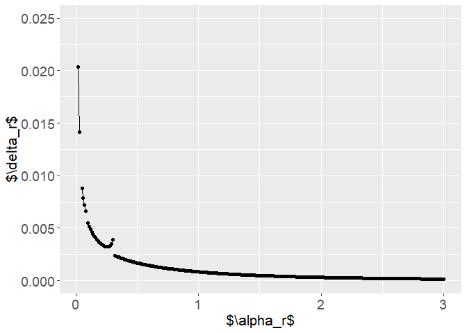<!-- -->

``` r
tikz("uplot-bipolar-ylimit",
     standAlone = TRUE, width = 6.5, height = 4.5)

uplot_bipolar +
  scale_y_continuous(limits = c(0, 0.025))
```

    ## Warning: Removed 3 rows containing missing values or values outside the scale range
    ## (`geom_point()`).

``` r
dev.off()
```

    ## png 
    ##   2

``` r
system("pdflatex uplot-bipolar-ylimit")
```

    ## [1] 0

``` r
uplot_bipolar +
  scale_x_continuous(limits = c(0, 0.4)) +
  scale_y_continuous(limits = c(0, 0.025))
```

    ## Warning: Removed 263 rows containing missing values or values outside the scale range
    ## (`geom_point()`).

    ## Warning: Removed 260 rows containing missing values or values outside the scale range
    ## (`geom_line()`).

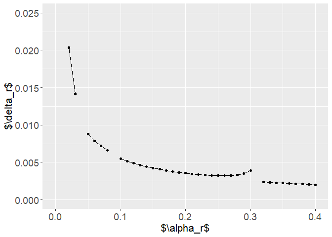<!-- -->

``` r
tikz("uplot-bipolar-ylimit-filter.tex",
     standAlone = TRUE, width = 6.5, height = 4.5)

uplot_bipolar +
  scale_x_continuous(limits = c(0, 0.4)) +
  scale_y_continuous(limits = c(0, 0.025))
```

    ## Warning: Removed 263 rows containing missing values or values outside the scale range
    ## (`geom_point()`).

    ## Warning: Removed 260 rows containing missing values or values outside the scale range
    ## (`geom_line()`).

``` r
dev.off()
```

    ## png 
    ##   2

``` r
system("pdflatex uplot-bipolar-ylimit-filter.tex")
```

    ## [1] 0

Next candidates.

``` r
matrix_to_latex(models_bd[[30]]$V |> round(2))
```

    ## 0.44 & 0.33 & 0.44 & 0.09 & 0.44 \\ 
    ## 0.26 & 0.18 & 0.36 & 0.03 & 0.52 \\ 
    ## 0.14 & 0.09 & 0.27 & 0.02 & 0.46 \\ 
    ## 0.16 & 0.11 & 0.3 & 0.02 & 0.52

``` r
matrix_to_latex(models_bd[[31]]$V |> round(2))
```

    ## 0.44 & 0.33 & 0.44 & 0.09 & 0.44 \\ 
    ## 0.26 & 0.18 & 0.36 & 0.03 & 0.52 \\ 
    ## 0.17 & 0.11 & 0.31 & 0.02 & 0.51 \\ 
    ## 0.13 & 0.08 & 0.25 & 0.01 & 0.47

------------------------------------------------------------------------

### U-plot for chaos data

``` r
set.seed(42)

umatrix <- create_random_U(matrix(0, nrow = 100, ncol = 3))

xx <- MASS::mvrnorm(n = 100, 
                    mu = c(0, 0), 
                    Sigma = matrix(c(1, 0, 0, 1), ncol = 2))

data1 <- as.data.frame(xx)
data1$group <- NA
data1[c(10, 79, 61, 12, 35), "class"] <- "$y^2$"
data1[c(52, 32, 98, 54, 34), "class"] <- "$y^1$"
data1[c(1, 77, 7, 75, 11), "class"] <- "$y^3$"
```

``` r
chaos1 <- 
ggplot(data1, aes(V1, V2, colour = class, group = class)) +
 geom_point() +
  scale_x_continuous(limits = c(-3, 3), breaks = -3:3, labels = -3:3) +
  scale_y_continuous(limits = c(-3, 3), breaks = -3:3, labels = -3:3) +
  xlab("$X_{:1}$") +
  ylab("$X_{:2}$")
```

``` r
chaos1
```

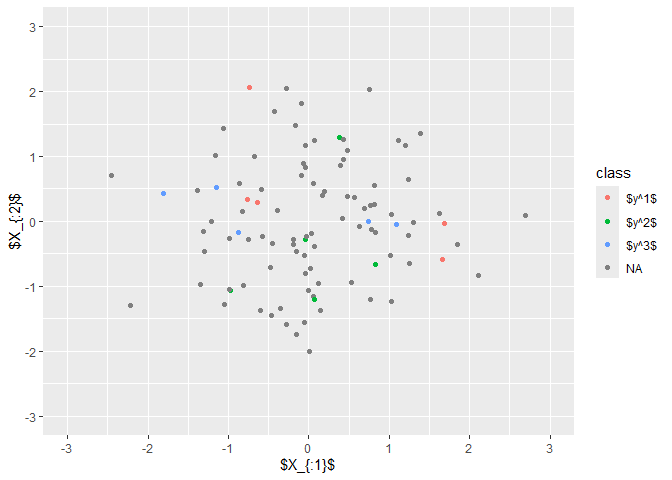<!-- -->

``` r
tikz("chaos-all.tex",
     standAlone = TRUE, width = 6.5, height = 4.5)

chaos1
dev.off()
```

    ## png 
    ##   2

``` r
system("pdflatex chaos-all")
```

    ## [1] 0

``` r
chaos2 <- 
ggplot(data1 %>% filter(!is.na(class)), 
       aes(V1, V2, colour = class, group = class)) +
 geom_point() +
  scale_x_continuous(limits = c(-3, 3), breaks = -3:3, labels = -3:3) +
  scale_y_continuous(limits = c(-3, 3), breaks = -3:3, labels = -3:3) +
  xlab("$X_{:1}$") +
  ylab("$X_{:2}$")
```

``` r
chaos2
```

<!-- -->

``` r
tikz("chaos-class.tex",
     standAlone = TRUE, width = 6.5, height = 4.5)

chaos2
dev.off()
```

    ## png 
    ##   2

``` r
system("pdflatex chaos-class")
```

    ## [1] 0

``` r
superFchaos <- matrix(0, nrow = 100, ncol = 3)

superFchaos[c(52, 32, 98, 54, 34), 1] <- 1
superFchaos[c(10, 79, 61, 12, 35), 2] <- 1
superFchaos[c(1,  77, 7, 75, 11),  3] <- 1
```

``` r
models_chaos <- list()
alphas <- seq(0.01, 5, 0.01)

for (k in seq_along(alphas)) {
  models_chaos[[k]] <- fussclust::SSFCM(
    X = xx, 
    C = 3, 
    U = umatrix,
    superF = superFchaos,
    alpha = alphas[k]
  )
}
```

``` r
rc <- create_uplot(models_chaos, alphas)
uplot_chaos <- rc$uplot
dd_chaos <- rc$df
```

``` r
uplot_chaos
```

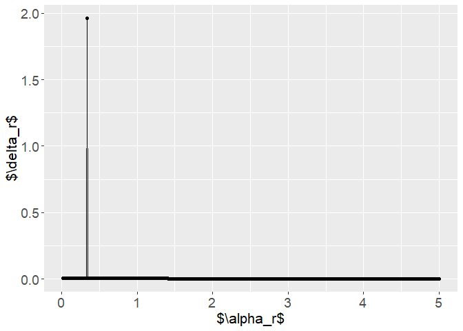<!-- -->

``` r
tikz("uplot-chaos-all.tex",
     standAlone = TRUE, width = 6.5, height = 4.5)

uplot_chaos
dev.off()
```

    ## png 
    ##   2

``` r
system("pdflatex uplot-chaos-all")
```

    ## [1] 0

``` r
uplot_chaos +
  scale_y_continuous(limits = c(0, 0.01))
```

    ## Warning: Removed 1 row containing missing values or values outside the scale range
    ## (`geom_point()`).

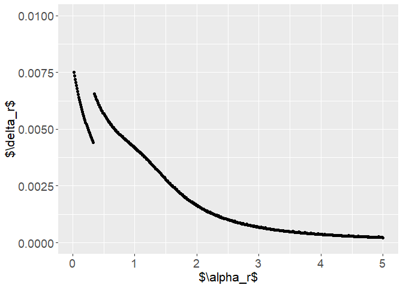<!-- -->

``` r
tikz("uplot-chaos-filter.tex",
     standAlone = TRUE, width = 6.5, height = 4.5)

uplot_chaos +
  scale_y_continuous(limits = c(0, 0.01))
```

    ## Warning: Removed 1 row containing missing values or values outside the scale range
    ## (`geom_point()`).

``` r
dev.off()
```

    ## png 
    ##   2

``` r
system("pdflatex uplot-chaos-filter")
```

    ## [1] 0

``` r
matrix_to_latex(models_chaos[[33]]$V |> round(2))
```

    ## -0.16 & 0.93 \\ 
    ## -0.39 & -0.8 \\ 
    ## 0.83 & 0.01

``` r
matrix_to_latex(models_chaos[[34]]$V |> round(2))
```

    ## 0.89 & 0.11 \\ 
    ## -0.32 & -0.85 \\ 
    ## -0.36 & 0.82

------------------------------------------------------------------------

## Chapter 5.1.6

------------------------------------------------------------------------

**Exemplary O-plot**

``` r
cm <- function(x) {
  matrix(x, ncol = 2, nrow = 2)
}
```

1.9 instead of 2

``` r
# xs <- c(3, 2.5, 2.75, 2.9, 2.95, 2.97, 2.98)
#xs <- c(3.5, 2.9, 3.15, 3.05, 3.03, 3.02)
xs <- c(3, 3.5, 3.1, 2.8, 3, 3.1, 3.05, 3.02)
ms <- lapply(as.list(xs), function(x) cm(x))
```

``` r
outms <- vector()
for (i in 2:(length(ms))) {
  outms <- c(outms, base::norm(ms[[i]] - ms[[i-1]], type = "f"))
}

zdf <- data.frame(
  # alpha = - seq(length(ms) - 1, 0),
  alpha = seq(1, length(ms)),
  value = c(NA, outms)
)

zdf$labs <- paste0("$r = ", zdf$alpha, "$")
# zdf$labs[nrow(zdf)] <- "$r$"


zplot <- 
zdf %>% 
  ggplot(aes(alpha, value)) + 
  geom_point() +
  geom_line() + 
  scale_y_continuous(limits = c(0, 1.5)) +
  ylab("$\\delta_r$") +
  xlab("$r$") +
    theme(
      axis.text.x = element_text(size = 14),
      axis.text.y = element_text(size = 14),
      axis.title.x = element_text(size = 16), #, margin = margin(t = 10)),
      axis.title.y = element_text(size = 16),
      legend.position = "none"
    ) +
  scale_x_continuous(
    limits = c(1, 7),
    breaks = zdf$alpha, 
    minor_breaks = zdf$alpha# ,
    # labels = zdf$labs
    )
```

``` r
zplot
```

    ## Warning: Removed 2 rows containing missing values or values outside the scale range
    ## (`geom_point()`).

    ## Warning: Removed 2 rows containing missing values or values outside the scale range
    ## (`geom_line()`).

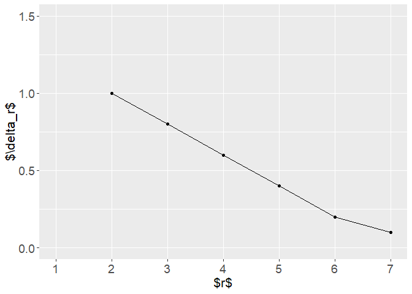<!-- -->

``` r
tikz("overimpact-random-walk.tex",
     standAlone = TRUE, width = 6.5, height = 4.5)

zplot
```

    ## Warning: Removed 2 rows containing missing values or values outside the scale range
    ## (`geom_point()`).

    ## Warning: Removed 2 rows containing missing values or values outside the scale range
    ## (`geom_line()`).

``` r
dev.off()
```

    ## png 
    ##   2

``` r
system("pdflatex overimpact-random-walk")
```

    ## [1] 0

``` r
vtext <- matrix(2.5, ncol = 2, nrow = 2)

zdf$fn <-
  lapply(ms, function(x) base::norm(x - vtext, type = "f")) |> unlist()
```

``` r
zfig <-
zdf %>%
  ggplot(aes(alpha, fn)) +
  geom_point() +
  geom_line() +
  scale_y_continuous(limits = c(0, 2.5)) +
  ylab("$\\mathrm{dif}_r$") +
  xlab("$r$") +
    theme(
      axis.text.x = element_text(size = 14),
      axis.text.y = element_text(size = 14),
      axis.title.x = element_text(size = 16), #, margin = margin(t = 10)),
      axis.title.y = element_text(size = 16),
      legend.position = "none"
    ) +
  scale_x_continuous(breaks = zdf$alpha)
```

``` r
zfig
```

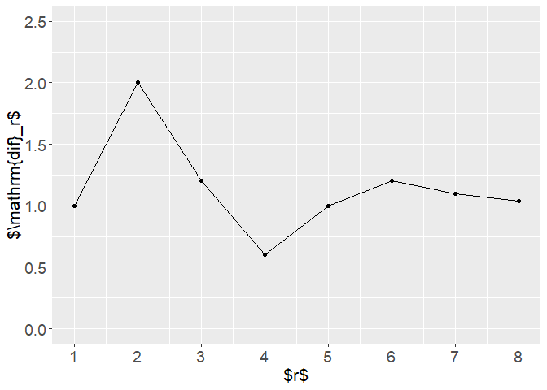<!-- -->

``` r
tikz("oplot-random-walk.tex",
     standAlone = TRUE, width = 6.5, height = 4.5)

zfig
dev.off()
```

    ## png 
    ##   2

``` r
system("pdflatex oplot-random-walk")
```

    ## [1] 0

------------------------------------------------------------------------

**O-plots for real data**

``` r
oplot <- function(.models, .superF) {
  .alphas <- sapply(.models, function(x) x$alpha)
  
  fn_values <-
  sapply(.models, function(x) base::norm(
    x$Phi_history[[x$counter]] - .superF, type = "f")
  )
  
  out <- data.frame(
    alpha = .alphas,
    r = seq_along(.alphas), 
    values = fn_values
  )
    
  return(out)
}
```

### o-plot for bipolar data

``` r
rc <- oplot(models_bd, superF2)
```

``` r
oplot_bd_1 <- ggplot(rc, aes(alpha, values)) +
  geom_line() + 
  scale_y_continuous(limits = c(0, 25)) +
  ylab("$\\nu_r$") +
  xlab("$\\alpha_r$") +
    theme(
      axis.text.x = element_text(size = 14),
      axis.text.y = element_text(size = 14),
      axis.title.x = element_text(size = 16), #, margin = margin(t = 10)),
      axis.title.y = element_text(size = 16),
      legend.position = "none"
    ) +
  geom_vline(xintercept = 0.31, colour = "red")
```

``` r
oplot_bd_1
```

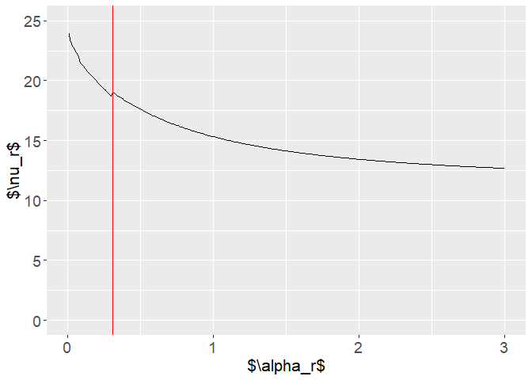<!-- -->

Bigger.

``` r
models_bd2 <- list()
alphas <- c(seq(0.1, 10, 0.1), 15, 20)


set.seed(42)

Uinit <- create_random_U(superF2)

for (k in seq_along(alphas)) {
  models_bd2[[k]] <- fussclust::SSFCM(
    X = Xall, 
    C = 4, 
    U = Uinit,
    superF = superF2,
    alpha = alphas[k]
  )
}
```

``` r
rc3 <- oplot(models_bd2, superF2)
```

``` r
oplot_bd_2 <- ggplot(rc3, aes(alpha, values)) +
  geom_line() +
  scale_y_continuous(limits = c(0, 25)) +
  geom_vline(xintercept = 0.31, colour = "red") +
  ylab("$\\nu_r$") +
  xlab("$\\alpha_r$") +
    theme(
      axis.text.x = element_text(size = 14),
      axis.text.y = element_text(size = 14),
      axis.title.x = element_text(size = 16), #, margin = margin(t = 10)),
      axis.title.y = element_text(size = 16),
      legend.position = "none"
    )
```

``` r
oplot_bd_2
```

<!-- -->

### Phi-plot to show it is impossible

``` r
model_bd_over <- fussclust::SSFCM(
  X = Xall, C = 4, U = Uinit, 
  superF = superF2, 
  alpha = 1e10)

over_box_bd <- create_df_model2(
  .Phi = model_bd_over$Phi_history[[model_bd_over$counter]], 
  .superF = superF2,
  .alpha = 1e10,
  .ncolumns = 4,
  enhance = TRUE
) %>%
  create_boxplot(.limits = c(0, 1))
```

``` r
over_box_bd
```

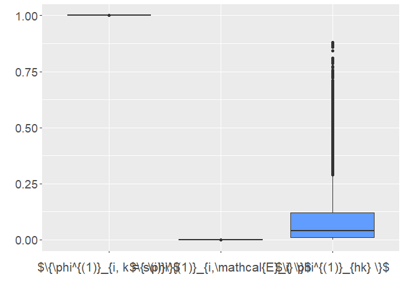<!-- -->

``` r
tikz("over-bd.tex",
     standAlone = TRUE, width = 6.5, height = 4.5)

over_box_bd
dev.off()
```

    ## png 
    ##   2

``` r
system("pdflatex over-bd")
```

    ## [1] 0

``` r
base::norm(model_bd_over$Phi_history[[model_bd_over$counter]] - superF2,
           type = "f") |> round(3)
```

    ## [1] 11.32

------------------------------------------------------------------------

### o-plot for iris data

``` r
rc <- oplot(models_iris, sfu$superF[-sfu$tind, ])
```

``` r
oplot_iris <- ggplot(rc, aes(alpha, values)) +
  geom_line() +
  geom_vline(xintercept = 0.16, colour = "red") + 
  scale_y_continuous(limits = c(0, 10)) +
  ylab("$\\nu_r$") +
  xlab("$\\alpha_r$") +
    theme(
      axis.text.x = element_text(size = 14),
      axis.text.y = element_text(size = 14),
      axis.title.x = element_text(size = 16), #, margin = margin(t = 10)),
      axis.title.y = element_text(size = 16),
      legend.position = "none"
    )
```

``` r
oplot_iris
```

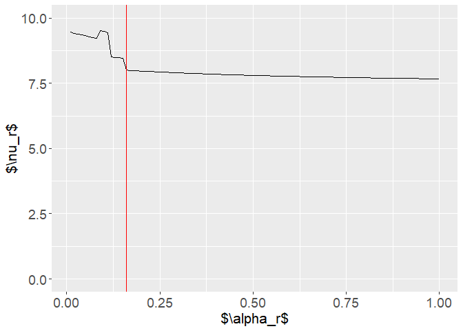<!-- -->

------------------------------------------------------------------------

### o-plot for chaos data

``` r
rc <- oplot(models_chaos, superFchaos)
```

``` r
oplot_chaos <- ggplot(rc, aes(alpha, values)) +
  geom_line() +
  geom_vline(xintercept = 0.34, colour = "red") + 
  scale_y_continuous(limits = c(0, 7)) +
  ylab("$\\nu_r$") +
  xlab("$\\alpha_r$") +
    theme(
      axis.text.x = element_text(size = 14),
      axis.text.y = element_text(size = 14),
      axis.title.x = element_text(size = 16), #, margin = margin(t = 10)),
      axis.title.y = element_text(size = 16),
      legend.position = "none"
    )
```

``` r
oplot_chaos
```

<!-- -->

### create tikzplots out of the ggplots

``` r
tikz("oplot_bd_1.tex",
     standAlone = TRUE, width = 6.5, height = 4.5)

oplot_bd_1
dev.off()
```

    ## png 
    ##   2

``` r
system("pdflatex oplot_bd_1")
```

    ## [1] 0

``` r
tikz("oplot_bd_2.tex",
     standAlone = TRUE, width = 6.5, height = 4.5)

oplot_bd_2
dev.off()
```

    ## png 
    ##   2

``` r
system("pdflatex oplot_bd_2")
```

    ## [1] 0

``` r
tikz("oplot_iris.tex",
     standAlone = TRUE, width = 6.5, height = 4.5)

oplot_iris
dev.off()
```

    ## png 
    ##   2

``` r
system("pdflatex oplot_iris")
```

    ## [1] 0

``` r
tikz("oplot_chaos.tex",
     standAlone = TRUE, width = 6.5, height = 4.5)

oplot_chaos
dev.off()
```

    ## png 
    ##   2

``` r
system("pdflatex oplot_chaos")
```

    ## [1] 0
