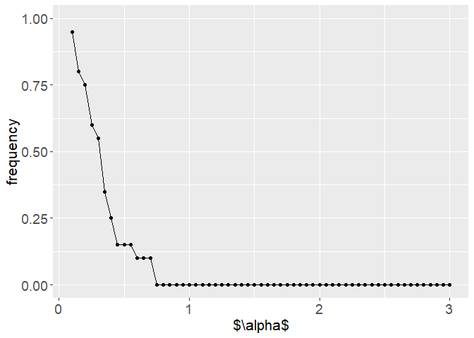
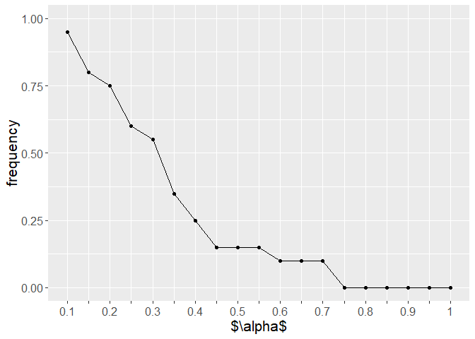
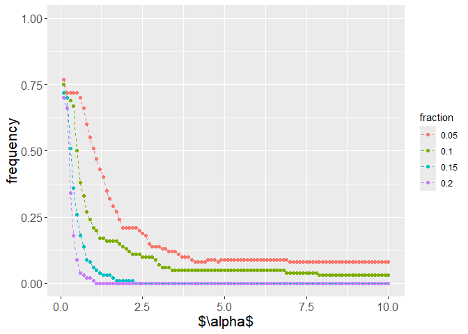
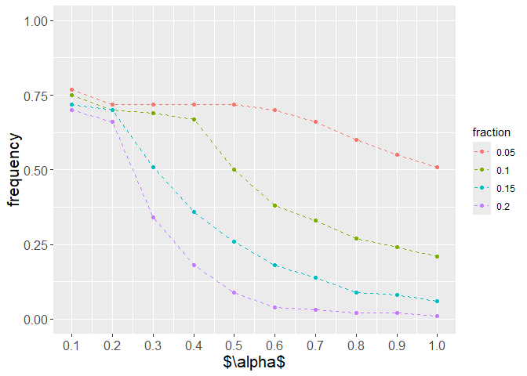

Material supporting the PhD analyses from Chapter 4, simulations.
================
Kamil Kmita

# 0 Set up of the notebook

``` r
set.seed(42)

library(fussclust)

library(ggplot2)
```

    ## Warning: pakiet 'ggplot2' został zbudowany w wersji R 4.5.2

``` r
library(tidyr)
```

    ## Warning: pakiet 'tidyr' został zbudowany w wersji R 4.5.2

``` r
library(dplyr)
```

    ## Warning: pakiet 'dplyr' został zbudowany w wersji R 4.5.2

    ## 
    ## Dołączanie pakietu: 'dplyr'

    ## Następujące obiekty zostały zakryte z 'package:stats':
    ## 
    ##     filter, lag

    ## Następujące obiekty zostały zakryte z 'package:base':
    ## 
    ##     intersect, setdiff, setequal, union

``` r
library(tikzDevice)
```

    ## Warning: pakiet 'tikzDevice' został zbudowany w wersji R 4.5.2

``` r
## add a package to the defaults
options(tikzLatexPackages=
            c(getOption("tikzLatexPackages"),"\\usepackage{fixltx2e}"))

library(MASS)
```

    ## 
    ## Dołączanie pakietu: 'MASS'

    ## Następujący obiekt został zakryty z 'package:dplyr':
    ## 
    ##     select

Auxiliary functions.

``` r
create_random_U <- function(nobs, C) {
  .U0 <- matrix(runif(nobs*C), ncol=C)
  .U0 <- t(apply(.U0, 1, function(x) x / sum(x)))

  return(.U0)
}


normalize_data <- function(X) {
  min_max_norm <- function(x) {
    (x - min(x)) / (max(x) - min(x))
  }
  
  Xout <- X
  for (r in 1:ncol(X)) {
    Xout[, r] <- min_max_norm(Xout[, r])
  }
  
  return(Xout)
}
```

``` r
create_uplot <- function(.models, .alphas, .filter = NA) {
  outcomes <- vector()
  
  for (i in 2:length(.models)) {
    outcomes <- c(outcomes,
                  base::norm(.models[[i]]$V - .models[[i-1]]$V, type = "f"))
  }
  
  df_for_uplot <- data.frame(
    alpha = .alphas[-1],
    value = outcomes
  )
  
  if (!is.na(.filter)) {
    df_for_uplot <- df_for_uplot %>% filter(alpha <= .filter)
  }
  
  uplot <- ggplot(df_for_uplot, aes(alpha, value)) +
    geom_point() +
    geom_line() +
    ylab("$\\delta_r$") +
    xlab("$\\alpha_r$") +
      theme(
        axis.text.x = element_text(size = 14),
        axis.text.y = element_text(size = 14),
        axis.title.x = element_text(size = 16), #, margin = margin(t = 10)),
        axis.title.y = element_text(size = 16),
        legend.position = "none"
      )
  
  return(list(df = df_for_uplot, uplot = uplot))
}
```

------------------------------------------------------------------------

# 1 dataset `bipolar` simulations

Bipolar data reading.

``` r
feature_names <- c(
  "avg_jitterlocal_sma",                
  "avg_jitterddp_sma",                  
  "avg_shimmerlocal_sma",               
  "avg_pcm_fftmag_spectralflux_sma",    
  "avg_pcm_fftmag_spectralcentroid_sma"
)

source_df1 <- read.csv("C:/Users/user/Desktop/doktorat/temp/baseline_long.csv",
                       sep = ";")

X <- source_df1[, feature_names]

labels_names <- c(
  "depression", "mixed", "euthymia", "dysfunction")

superFf <- source_df1[, labels_names]

Xbd <- normalize_data(X) |> as.matrix()
superFbd <- as.matrix(superFf)
```

``` r
BIPOLAR_ITERATIONS = 20
```

``` r
uis <- replicate(n = BIPOLAR_ITERATIONS, 
                 create_random_U(nrow(Xbd), 4), simplify = FALSE)
```

``` r
superfs <- list(superFbd)
```

A function `create_underimpact_ss` applying Rule 2 from thesis.

``` r
create_underimpact_ss <- function(.models, .counter) {
  alphas <- sapply(.models, function(x) x$alpha)
  rc <- create_uplot(.models, alphas)
  df <- rc$df
  
  df$flag <- ifelse(df$value < sd(df$value), 0, 1)
  alpha_dagger <- max(df[df$flag == 1, "alpha"])
  df$underimpact <- ifelse(df$alpha < alpha_dagger, 1, 0)
  
  df$counter <- .counter
  
  return(df[, c("alpha", "underimpact", "counter")])
}
```

``` r
out_models <- list()

START = Sys.time()

alphas <- seq(0.05, 3, 0.05)

percies <- c(1)

counter <- 0

out_percies <- list()

for (perc_iter in seq_along(percies)) {

  out_random <- list()

  superfs_perc_iter <- superfs[[perc_iter]]    
  perc_value <- percies[perc_iter]

  for (superf_iter in 1:1) {
    superF_i <- superfs_perc_iter

    for (U_i_iter in 1:BIPOLAR_ITERATIONS) {
      counter <- counter + 1
      
      U_i <- uis[[U_i_iter]]

      models <- lapply(
        as.list(alphas), function(x) {
          fussclust::SSFCM(X = Xbd, C = 4, U = U_i, superF = superF_i, alpha = x)
        }
      )
      
      gc()
      
      result_i <- create_underimpact_ss(models, counter)

      out_models[[counter]] <- models
      out_random[[counter]] <- result_i
    }
  }
  
  out_percies[[perc_iter]] <- do.call(rbind, out_random)
  out_percies[[perc_iter]]$percentage <- perc_value

}

END = Sys.time()
```

``` r
print(paste0("n: ", BIPOLAR_ITERATIONS, " >> START: ", START, " || END: ", END))
```

    ## [1] "n: 20 >> START: 2026-02-11 11:03:20.940251 || END: 2026-02-11 11:04:37.364521"

``` r
out_experiment <- do.call(rbind, out_percies)
out_experiment$percentage <- factor(out_experiment$percentage)
```

``` r
out_grouped <-
  out_experiment %>%
  group_by(alpha, percentage) %>%
  summarise(mean = mean(underimpact))
```

    ## `summarise()` has regrouped the output.
    ## ℹ Summaries were computed grouped by alpha and percentage.
    ## ℹ Output is grouped by alpha.
    ## ℹ Use `summarise(.groups = "drop_last")` to silence this message.
    ## ℹ Use `summarise(.by = c(alpha, percentage))` for per-operation grouping
    ##   (`?dplyr::dplyr_by`) instead.

``` r
saveRDS(out_grouped, file = "C:/Users/user/Desktop/doktorat/temp/bd_exp-2.rds")
```

``` r
sim_bipolar <-
ggplot(out_grouped, aes(alpha, mean)) +
  geom_point() +
  geom_line() +
  scale_y_continuous(limits = c(0, 1)) +
  ylab("frequency") +
  xlab("$\\alpha$") +
      theme(
        axis.text.x = element_text(size = 14),
        axis.text.y = element_text(size = 14),
        axis.title.x = element_text(size = 16), #, margin = margin(t = 10)),
        axis.title.y = element_text(size = 16),
        legend.position = "none"
      )
```

``` r
sim_bipolar
```

<!-- -->

``` r
custom_xlabels <- function(.vector) {
  out <- 
    unlist(Map(c, as.character(.vector), 
               rep("", length(.vector))))
  
  out <- out[1:(length(out) - 1)]
  
  return(out)
}
```

``` r
sim_bipolar_filter <-
ggplot(out_grouped %>% filter(alpha <= 1), aes(alpha, mean)) +
  geom_point() +
  geom_line() +
  scale_y_continuous(limits = c(0, 1)) +
  ylab("frequency") +
  xlab("$\\alpha$") +
      theme(
        axis.text.x = element_text(size = 12),
        axis.text.y = element_text(size = 12),
        axis.title.x = element_text(size = 16), #, margin = margin(t = 10)),
        axis.title.y = element_text(size = 16),
        legend.position = "none"
      ) +
  scale_x_continuous(
    breaks = seq(0.1, 1, 0.05),
    minor_breaks = NULL,
    labels = custom_xlabels(seq(0.1, 1, 0.1))
  )
```

``` r
sim_bipolar_filter
```

<!-- -->

``` r
tikz("sim-bipolar-whole.tex",
     # standAlone = TRUE, width = 6.5, height = 4.5)
     standAlone = TRUE, width = 7, height = 4.5)

sim_bipolar

dev.off()
```

    ## png 
    ##   2

``` r
system("pdflatex sim-bipolar-whole.tex")
```

    ## [1] 0

``` r
tikz("sim-bipolar-filter.tex",
     # standAlone = TRUE, width = 6.5, height = 4.5)
     standAlone = TRUE, width = 7, height = 4.5)

sim_bipolar_filter

dev.off()
```

    ## png 
    ##   2

``` r
system("pdflatex sim-bipolar-filter.tex")
```

    ## [1] 0

``` r
paste0(out_grouped[out_grouped$mean > 0, "alpha"] |> unlist(), collapse = " & ")
```

    ## [1] "0.1 & 0.15 & 0.2 & 0.25 & 0.3 & 0.35 & 0.4 & 0.45 & 0.5 & 0.55 & 0.6 & 0.65 & 0.7"

``` r
paste0(out_grouped[out_grouped$mean > 0, "mean"] |> unlist(), collapse = " & ")
```

    ## [1] "0.95 & 0.8 & 0.75 & 0.6 & 0.55 & 0.35 & 0.25 & 0.15 & 0.15 & 0.15 & 0.1 & 0.1 & 0.1"

------------------------------------------------------------------------

# dataset `iris` simulations

``` r
set.seed(42)
```

``` r
X <- iris[, c("Sepal.Length", "Sepal.Width")] |> as.matrix()
```

``` r
# assumes order in superF
# mod(nobs/C) must be 0
create_all_indices <- function(nobs, C, .perc = 0.2) {
  nc <- nobs/C
  upper_limits <- (1:C)*nc
  lower_limits <- c(1, upper_limits[1:(C-1)] + 1)
  
  
  out <- list()
  
  for (iter in 1:C) {
    xs <- seq(lower_limits[iter], upper_limits[iter])
    
    out[[iter]] <- sample(x = xs, size = floor(.perc * nc))
  }
  
  return(out)
}


create_superf_index <- function(nobs, C, indexer) {
  f <- matrix(0, nrow = nobs, ncol = C)
  
  for (i in 1:C) {
    f[indexer[[i]], i] <- 1
  }
  
  return(f)
}
```

``` r
indices_20 <- lapply(1:10, function(x) create_all_indices(150, 3))
indices_15 <- list()
indices_10 <- list()
indices_05 <- list()

for (i in 1:10) {
  indices_15[[i]] <- lapply(indices_20[[i]], function(x) x[1:8])
  indices_10[[i]] <- lapply(indices_20[[i]], function(x) x[1:5])
  indices_05[[i]] <- lapply(indices_20[[i]], function(x) x[1:3])
}

# indices_15 <- lapply(indices_20, function(x) x[1:8])
# indices_10 <- lapply(indices_20, function(x) x[1:5])
# indices_05 <- lapply(indices_20, function(x) x[1:3])

superfs_20 <- lapply(indices_20, function(x) create_superf_index(150, 3, x))
superfs_15 <- lapply(indices_15, function(x) create_superf_index(150, 3, x))
superfs_10 <- lapply(indices_10, function(x) create_superf_index(150, 3, x))
superfs_05 <- lapply(indices_05, function(x) create_superf_index(150, 3, x))

superfs <- list(superfs_05, superfs_10, superfs_15, superfs_20)
```

``` r
# returns 1 if underimpact occurred
check_underimpact <- function(.V) {
  as.numeric(!identical(rank(.V[, 1]), c(1, 2, 3)))
}
```

``` r
uis <- replicate(n = 10, create_random_U(150, 3), simplify = FALSE)
```

``` r
alphas <- seq(0.1, 10, 0.1)

percies <- c(.05, .1, .15, .2)

counter <- 0

out_percies <- list()

START = Sys.time()

for (perc_iter in seq_along(percies)) {

  out_random <- list()

  superfs_perc_iter <- superfs[[perc_iter]]    
  perc_value <- percies[perc_iter]

  for (superf_iter in 1:10) {
    superF_i <- superfs_perc_iter[[superf_iter]]

    for (U_i_iter in 1:10) {
      counter <- counter + 1
      
      U_i <- uis[[U_i_iter]]

      models <- lapply(
        as.list(alphas), function(x) {
          fussclust::SSFCM(X = X, C = 3, U = U_i, superF = superF_i, alpha = x)
        }
      )
      
      result_i <- data.frame(
        alpha = alphas,
        underimpact = sapply(models, function(x) check_underimpact(x$V)),
        counter = counter
      )
      
      result_i$superf_iter <- superf_iter
      result_i$U_i_iter <- U_i_iter

      out_random[[counter]] <- result_i
    }
  }
  
  out_percies[[perc_iter]] <- do.call(rbind, out_random)
  out_percies[[perc_iter]]$percentage <- perc_value

}

END = Sys.time()
```

``` r
print(paste0("n: ", BIPOLAR_ITERATIONS, " >> START: ", START, " || END: ", END))
```

    ## [1] "n: 20 >> START: 2026-02-11 11:05:43.897217 || END: 2026-02-11 11:10:23.101014"

``` r
out_experiment <- do.call(rbind, out_percies)
out_experiment$percentage <- factor(out_experiment$percentage)
```

``` r
out_grouped <-
  out_experiment %>%
  group_by(alpha, percentage) %>%
  summarise(mean = mean(underimpact))
```

    ## `summarise()` has regrouped the output.
    ## ℹ Summaries were computed grouped by alpha and percentage.
    ## ℹ Output is grouped by alpha.
    ## ℹ Use `summarise(.groups = "drop_last")` to silence this message.
    ## ℹ Use `summarise(.by = c(alpha, percentage))` for per-operation grouping
    ##   (`?dplyr::dplyr_by`) instead.

``` r
saveRDS(out_grouped, file = "C:/Users/user/Desktop/doktorat/temp/iris_exp-2.rds")
```

``` r
out_grouped$fraction <- out_grouped$percentage
```

``` r
sim_iris <- 
  ggplot(out_grouped, aes(alpha, mean, colour = fraction, group = fraction)) +
  geom_point() +
  geom_line(linetype = "dashed") +
  scale_y_continuous(limits = c(0, 1)) +
  ylab("frequency") +
  xlab("$\\alpha$") +
      theme(
        axis.text.x = element_text(size = 12),
        axis.text.y = element_text(size = 12),
        axis.title.x = element_text(size = 16), #, margin = margin(t = 10)),
        axis.title.y = element_text(size = 16)
        # legend.position = "none"
      )
```

``` r
sim_iris
```

<!-- -->

``` r
sim_iris_filter <- 
  ggplot(out_grouped %>% filter(alpha <= 1), 
         aes(alpha, mean, colour = fraction, group = fraction)) +
  geom_point() +
  geom_line(linetype = "dashed") +
  scale_y_continuous(limits = c(0, 1)) +
  ylab("frequency") +
  xlab("$\\alpha$") +
      theme(
        axis.text.x = element_text(size = 12),
        axis.text.y = element_text(size = 12),
        axis.title.x = element_text(size = 16), #, margin = margin(t = 10)),
        axis.title.y = element_text(size = 16)
        # legend.position = "none"
      ) +
  scale_x_continuous(breaks = seq(0, 1, 0.1), minor_breaks = waiver())
```

``` r
sim_iris_filter
```

<!-- -->

``` r
tikz("sim-iris-whole.tex",
     # standAlone = TRUE, width = 6.5, height = 4.5)
     standAlone = TRUE, width = 7, height = 4.5)

sim_iris

dev.off()
```

    ## png 
    ##   2

``` r
system("pdflatex sim-iris-whole.tex")
```

    ## [1] 0

``` r
tikz("sim-iris-filter.tex",
     # standAlone = TRUE, width = 6.5, height = 4.5)
     standAlone = TRUE, width = 7, height = 4.5)

sim_iris_filter

dev.off()
```

    ## png 
    ##   2

``` r
system("pdflatex sim-iris-filter.tex")
```

    ## [1] 0
